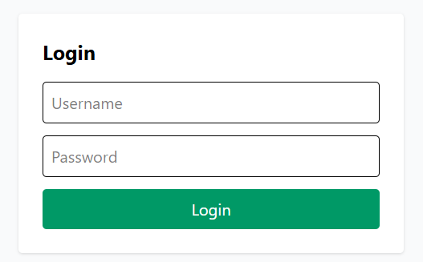
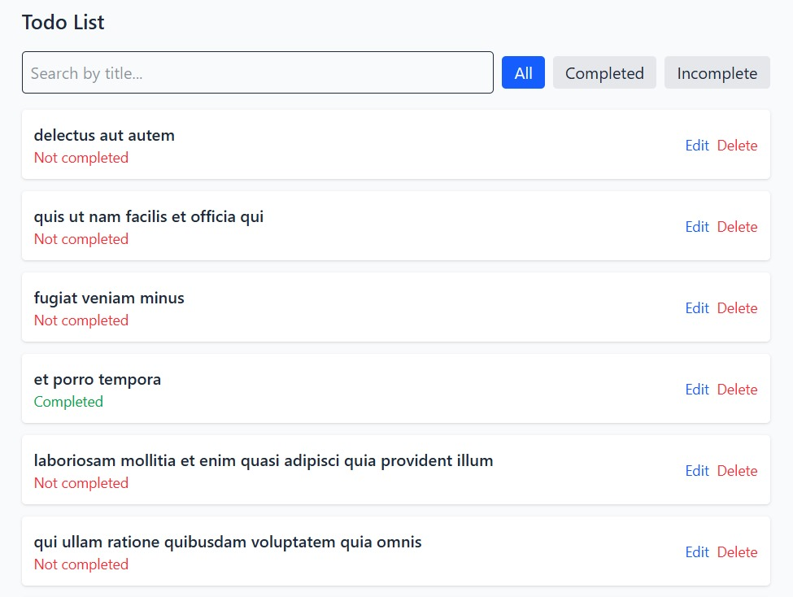
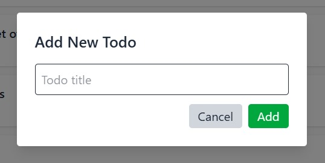

# 📝 React Typescript Todo App

A fully functional Todo web application built with **React Typescript**, **React Router v7**, and **Tailwind CSS**, using **JSONPlaceholder** for API integrations. The creating, editing and deleting modals of this application are fully functional at the UI level but those actions are not carried out at the back end due to the fact that we are dealing with a dummy database, hence those actions are for demonstration purposes.

## 📌 Features

- **Authentication** This allows you log into the app
- **Skeleton 💀** as the first component to load the page contents
- Fetch todos from API with **pagination** (10 items per page)
- **Search** todos by title
- **Filter** by completion status (All, Completed, Incomplete items)
- View **individual todo details** on a separate page
- **Create**, **Edit**, and **Delete** todos with modal forms
- **Error Boundary** for error handling
- **Custom 404 page** for undefined routes
- **Logout** This automatically logs one out of the system on click of it
- Fully **responsive** design for desktop, tablet, and mobile.

## 🚀 Login Details
Want to try out the page?
User authentication (login)
**Username** = admin and **Password** = 1234

## 🚀 Installation and Setup

1️⃣ Clone the repository:

git clone [Git-hub](https://github.com/Git-Angel/ToDo_Project_Typescript)
cd SecondProject

2️⃣ Install Dependencies:
`npm install`

3️⃣ Start development server:
`npm run dev`

4️⃣ Build for production:
`npm run build`

---

## 🏁 Deployment Options
You can deploy your build folder to any static site hosting platform. For example:

✅ Deploy to Netlify:
Sign up at [Netlify](https://www.netlify.com/)

Connect your GitHub repository or drag-and-drop the dist/ or build/ folder.

For Vite apps, set Build Command: npm run build, Publish Directory: dist/

Click Deploy Site.

✅ Deploy to Vercel:
Sign up at https://vercel.com/ example of the outcome
 [MY Vercel Link](https://to-do-project-typesc-git-29a710-angelina-chima-onuohas-projects.vercel.app/)

Connect your GitHub repository.

For Vite apps, set Framework Preset to Vite, and build settings will auto-configure.

Click Deploy.

## ✍ Available Scripts (Script and purpose)

---
`npm run dev` - Start development server
`npm run build` - Build optimized production
`npm run preview` - Preview production build locally

---

## 🛠️ Tech Stack (Technology and purpose)

React Typescript - UI Framework
React Router v7 - Routing / Nested routes
Tailwind CSS - Styling and responsiveness
Lucide React - Icon library
JSONPlaceholder - API for todos

## 🌐 API Documentation (Method, endpoint and description)
Base URL: [Baseurl](`https://jsonplaceholder.typicode.com`)

| Method | Endpoint     | Description            |
| ------ | ------------ | ---------------------- |
| GET    | `/todos`     | Fetch all todos        |
| GET    | `/todos/:id` | Fetch single todo      |
| POST   | `/todos`     | Create new todo        |
| PUT    | `/todos/:id` | Update existing todo   |
| DELETE | `/todos/:id` | Delete todo            |

## 📸 Screenshots of key features

| Feature        | Screenshots                                                                                          |
| -------------- | -----------------------------------------------------------------------------------------------------|
|Authentication  | Login details: Username = **admin** and Password = **1234**                                          |
|Authentication  |    **Authenticate to access the Todo App**        |
| Todo List View |    **View of todos with filters**                       |
| Add Todo Modal |    **Modal for adding a new todo item**                        |
| 404 Page       |    **Custom 404 error page with navigation back home**   |
|SignOut Button  |    **Automatically logs one out of the system on click of it** |

## ⚠ Limitations

The Add/Edit/Delete are not persisted because JSONPlaceholder is a mock API.

Error boundary catches frontend errors but cannot detect failed API calls yet.

## 🔮 Future Improvements

Connect to a real backend API (Node/Express, Firebase, etc.)

Implement persistent local storage or IndexedDB fallback

Add unit tests with Jest/React Testing Library

Build application own database

## React + Vite (Advise)

Currently, two official plugins are available:

- [@vitejs/plugin-react](https://github.com/vitejs/vite-plugin-react/blob/main/packages/plugin-react)
uses [Babel](https://babeljs.io/) for Fast Refresh
- [@vitejs/plugin-react-swc](https://github.com/vitejs/vite-plugin-react/blob/main/packages/plugin-react-swc)
uses [SWC](https://swc.rs/) for Fast Refresh

## Expanding the ESLint configuration

If you are developing a production application, we recommend using TypeScript with type-aware lint rules enabled.
Check out the [TStemplate](https://github.com/vitejs/vite/tree/main/packages/create-vite/template-react-ts)
for information on how to integrate TypeScript and [`typescript-eslint`](https://typescript-eslint.io) in your future projects.
